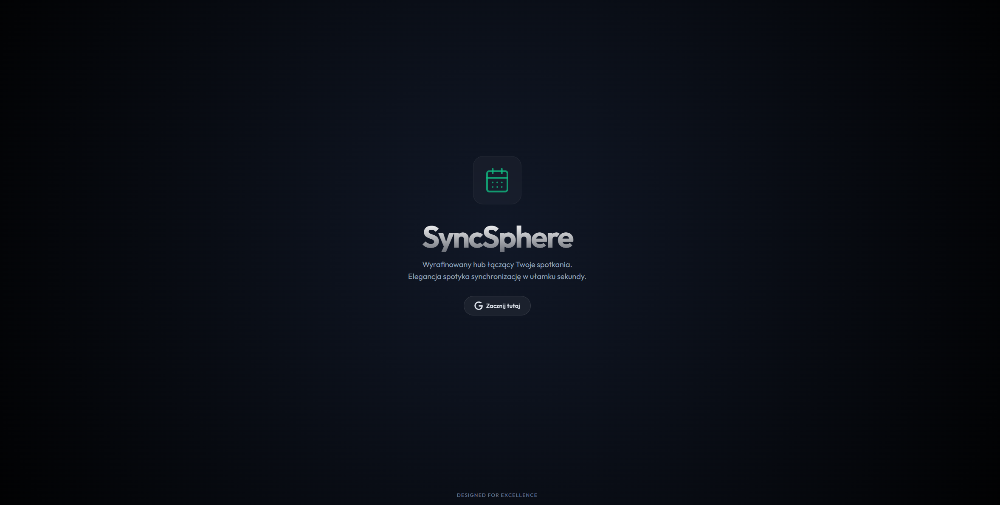
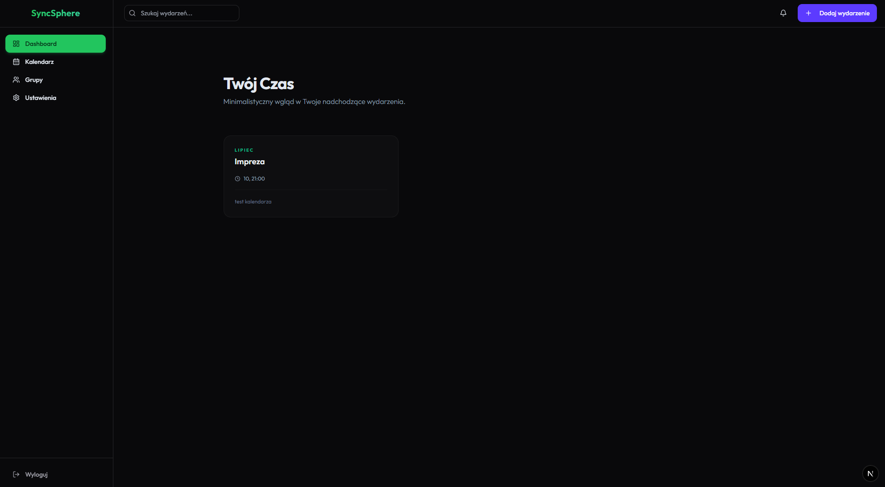
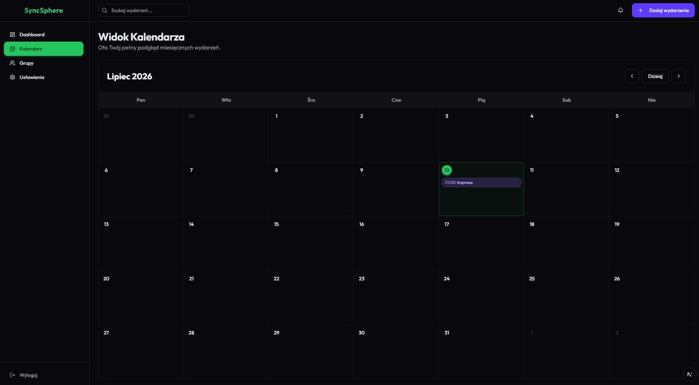

# SyncSphere

> **Work in progress (WIP)** — this project is under active development. UI, API, and documentation may change between commits. Do not treat this as a production-ready release.

**[Polski](README.pl.md)**

SyncSphere is a modern calendar and planner app with **Google Calendar** integration. It lets you browse events, create meetings, manage team groups, and send invitations to group members.

Built as a **Turborepo** monorepo with **pnpm workspaces** and a full **Docker Compose** development environment.

## Preview (WIP)

Screenshots below are indicative (mockups based on the current design, not live captures) — the interface may change in future iterations.

| Landing page | Dashboard | Calendar |
| ------------ | --------- | -------- |
|  |  |  |

## Key features

| Feature | Description |
| ------- | ----------- |
| **Google OAuth login** | Authentication via Google account with calendar scope |
| **Event sync** | Fetch upcoming events from Google Calendar (primary calendar) |
| **Event creation** | Create meetings with optional group member invitations |
| **Dashboard** | Minimal overview of upcoming events |
| **Calendar view** | Monthly grid with events and details |
| **Groups** | Create teams, add members by email, limit of 5 groups per user |
| **Invitations** | Send, accept, and decline event invitations |
| **Notifications** | Top bar with pending invitation counter |

## Tech stack

| Layer | Technologies |
| ----- | ------------ |
| **Frontend** | Next.js 16 (App Router), React 19, Tailwind CSS v3, Shadcn UI, SWR, date-fns, Framer Motion |
| **Backend** | NestJS 11, Passport (Google OAuth + JWT), class-validator |
| **Database** | PostgreSQL 16, Prisma 7 |
| **Integrations** | Google Calendar API (googleapis) |
| **Infrastructure** | Docker Compose, Docker Compose Watch |
| **Monorepo** | Turborepo, pnpm 9, TypeScript 5.9 |

## Architecture

```
Browser → web (Next.js :3000) → api (NestJS :3001) → db (PostgreSQL :5432)
                               ↘ Google Calendar API (OAuth)
```

## Planned improvements

- [ ] **Unit tests** — expand API coverage (currently only NestJS scaffold)
- [ ] **E2E tests (Playwright)** — login, calendar, and groups flows
- [ ] **Internationalization (i18n)** — translation keys instead of hardcoded UI strings
- [ ] **Light mode** — only dark mode is available today (zinc palette + bottle green accents)
- [ ] **Settings page** — sidebar link exists, view is not implemented yet
- [ ] **Production deployment** — CI/CD and hosting setup
- [ ] **And more** — ongoing improvements as the project evolves

## Directory layout

```
apps/web/              → Next.js frontend (port 3000)
apps/api/              → NestJS backend (port 3001)
packages/database/     → Prisma schema, client, migrations
packages/tsconfig/     → shared TypeScript configs
docker-compose.yml     → development environment
docs/screenshots/      → UI previews (WIP)
```

## Requirements

- **Docker** and **Docker Compose**
- Google Cloud account with OAuth 2.0 configured
- `.env` file in the repository root (template: [`.env.example`](.env.example))

## Quick start

1. Clone the repository and create `.env` from `.env.example`.
2. Fill in `GOOGLE_CLIENT_ID`, `GOOGLE_CLIENT_SECRET`, and `JWT_SECRET`.
3. Start the stack:

```bash
docker compose watch
```

4. Open [http://localhost:3000](http://localhost:3000) and sign in with Google.

## Environment variables

```env
DATABASE_URL=postgresql://devuser:devpassword@db:5432/calendar_db?schema=public
GOOGLE_CLIENT_ID=
GOOGLE_CLIENT_SECRET=
JWT_SECRET=
FRONTEND_URL=http://localhost:3000
NEXT_PUBLIC_API_URL=http://localhost:3001
```

`docker-compose.yml` overrides `DATABASE_URL` for containers. OAuth and JWT variables are loaded from `.env`.

## URLs after startup

| Resource | URL |
| -------- | --- |
| Frontend | http://localhost:3000 |
| Dashboard | http://localhost:3000/dashboard |
| Calendar | http://localhost:3000/dashboard/calendar |
| Groups | http://localhost:3000/dashboard/groups |
| Google login | http://localhost:3001/auth/google |
| API | http://localhost:3001 |

## API overview

| Endpoint | Description |
| -------- | ----------- |
| `GET /auth/google` | Start Google login |
| `GET /calendar/events` | List events (JWT) |
| `POST /calendar/events` | Create event, optionally with `groupId` (JWT) |
| `GET /groups` | List user groups (JWT) |
| `POST /groups` | Create group (JWT) |
| `POST /groups/:id/members` | Add member by email (JWT) |
| `GET /invitations/pending` | Pending invitations (JWT) |
| `POST /invitations/:id/accept` | Accept invitation (JWT) |
| `POST /invitations/:id/decline` | Decline invitation (JWT) |

## Common commands

Run all commands from the repository root.

```bash
# Dependencies
docker compose exec api pnpm install

# Prisma — generate client
docker compose exec api pnpm prisma generate --schema=./packages/database/prisma/schema.prisma

# Prisma — migration (dev)
docker compose exec api pnpm prisma migrate dev --name <name> \
  --schema=./packages/database/prisma/schema.prisma \
  --config=./packages/database/prisma.config.ts

# Tests and lint
docker compose exec api pnpm --filter api test
docker compose exec api pnpm run lint
docker compose exec web pnpm --filter web lint

# Logs
docker compose logs -f api
```

> The project runs **entirely in Docker**. Do not run `pnpm`, `prisma`, `nest`, or `next` directly on the host.

Developer and AI agent instructions: [`AGENTS.md`](./AGENTS.md).

## Troubleshooting

| Issue | Solution |
| ----- | -------- |
| `Module not found` after adding a package | `docker compose exec web pnpm install` or `docker compose up -d --build web` |
| Missing database tables | `docker compose exec api pnpm prisma db push --schema=./packages/database/prisma/schema.prisma --config=./packages/database/prisma.config.ts` |
| File changes not visible on Windows | Use `docker compose watch` (polling enabled in compose) |
| Stale `node_modules` volume | `docker compose down` → remove `*_node_modules` volumes → `docker compose up -d --build` |

## License

This project is licensed under the [MIT License](LICENSE).
